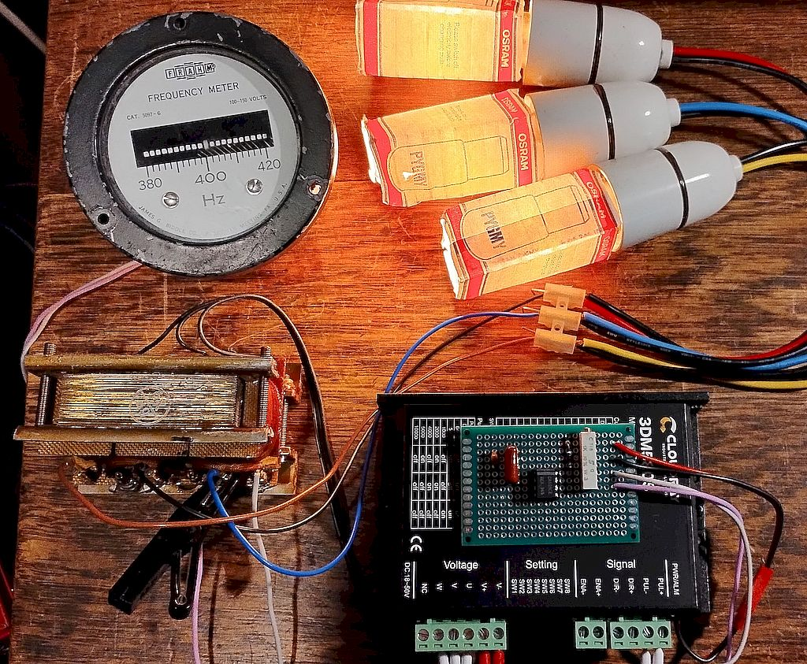
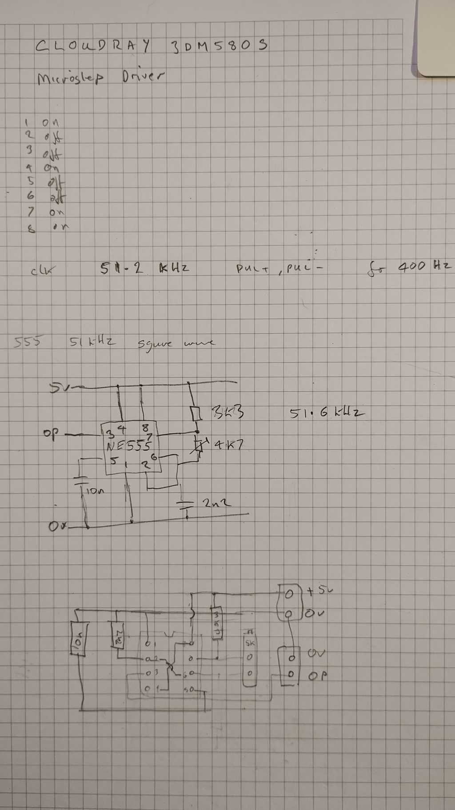

# Microstep_400Hz_Inverter
Repurpose Cloudray 3DM580S microstep stepper motor driver as 400 Hz three phase inverter driver 

[Photos](./Images/README.md)

Based on the idea presented on youtube in the Labo de Michel channel video [LDM #391: ](https://youtu.be/uqSumr_xGSk?si=lCm-YSXonkFbhdTS)

In this version, instead of using an external signal generator the stepper motor driver has been opened to access its internal 5 vold DC supply to supply power to a 555 astable oscilator. This is used as source for the step input.

As in Michel's example I use 51.2 kHz as clock to output 400Hz waveform into a three phase transformer wired for voltage step-up. Seen here driving three lamps as a test load and a vibrating reed frequency meter.

